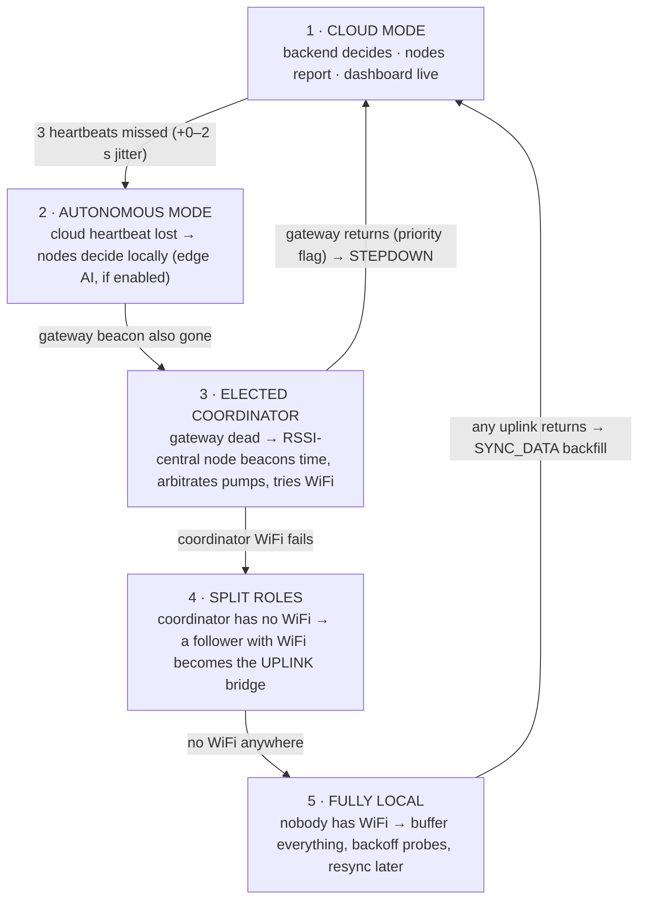

# AquaVerse — Resilient Edge-AI Architecture
*Living document — updated per phase. Phase 1 implemented; Phases 2–7 designed.*

## 1. Failover ladder

Each rung loses comfort, never control.



| Phase | Status |
|---|---|
| 1 — protocol + roles + heartbeat + mode switching | ✅ implemented |
| 2 — F1 decision model (shadow mode) | designed |
| 3 — LittleFS buffering + backfill sync | designed |
| 4 — election + coordinator + uplink delegation | designed |
| 5 — F2 sensor autoencoder | designed |
| 6 — F3 adaptive radio + ACKs | designed |
| 7 — F4 forecasting + proactive irrigation | designed |

## 2. Dual-stack protocol (decision)

The platform's existing data plane is **compact JSON** (keys `s,t,h,b,bv,bi,bm,tm,c,q,vp,p,slp,awk,nap,up`),
already parsed by the gateway, backend and dashboard. Rather than migrating it,
the resilience layer adds a **binary control plane**:

* Byte 0 discriminates: `0x7B` (`{`) → JSON · `0xA5` → binary frame.
* JSON carries telemetry / alive / commands — unchanged, zero risk.
* Binary carries HEARTBEAT, ELECT, COORD_BEACON, CONFLICT, STEPDOWN,
  PUMP_REQ/GRANT/WAIT, UPLINK_PROBE_REQ/OK, SYNC_DATA, ACK, DECISION.
* Telemetry migrates to binary only in Phase 6 (with ACKs), if ever.

### Frame format (`firmware/shared/protocol.h` — source of truth)

```
[magic 0xA5][nodeId u8][msgType u8][term u16][seq u16][len u8][payload ≤50 B][crc16 u16]
```
* CRC-16/CCITT-FALSE over everything before the CRC.
* `nodeId 0` = gateway, `0xFF` = broadcast.
* `term` = election epoch (persisted in NVS); frames from older terms are ignored.

### HEARTBEAT payload (6 B)
```
[cloudSeq u32][flags u8][rsv u8]
flags: bit0 CLOUD_UP · bit1 AI_ENABLED · bit2 GW_PRIORITY
```

## 3. Heartbeat & mode switching (Phase 1, implemented)

* Backend publishes `farms/{farmId}/system/heartbeat` `{seq, ai, ts}` every **10 s**
  (per farm; carries the dashboard's **Edge-AI switch**, `PUT /api/system/ai`).
* Gateway relays each one over LoRa as a binary HEARTBEAT beacon (CLOUD_UP set).
* If the backend goes silent **>15 s**, the gateway keeps beaconing every 10 s
  itself with CLOUD_UP **cleared** → nodes learn "gateway alive, cloud down".
* Node rule: **3 consecutive missed beacons + random 0–2 s jitter → AUTONOMOUS**;
  any beacon with CLOUD_UP restores CLOUD mode instantly.
* Unified firmware reports `md` (0 CLOUD / 1 AUTONOMOUS) and `ai` in telemetry →
  backend forwards as `sys_mode` / `ai_flag` in `sensor:data`.

## 4. Roles (single image, runtime identity)

`firmware/unified_node/` — identity in NVS (Preferences, namespace `aqv`):
`nodeId, deviceId, farmId, wifi ssid/pass, role, term`. Serial wizard on first
boot; `prov` re-runs it, `info` dumps state.

| Role | Sleep policy | Duties |
|---|---|---|
| NODE | deep-sleep duty cycle allowed (existing behaviour) | sense, report, obey, mode-track |
| COORDINATOR | always-on | beacon time, arbitrate pumps (FIFO, one at a time), aggregate, try WiFi (backoff 1→2→4→8→15 min cap) |
| UPLINK | always-on | LoRa→MQTT bridge when delegated |
| GATEWAY | always-on (mains) | full bridge + pump relay (production: `gateway_ra02.ino` until parity) |

**Decision: deep sleep is NODE-only.** A sleeping node re-evaluates mode at
every wake; coordinators/uplinks never sleep.

## 5. Election (Phase 4 design)

* Passive neighbour table from every received frame: `{nodeId, ewma_rssi (α=0.2), last_heard}`, 5 min expiry.
* Trigger: gateway beacon missed 3× → broadcast `ELECT(myId, score, term+1)` once, listen 5 s.
* Score: `Σ(rssi_i + 130) − 80 × (expected_neighbors − heard_neighbors)`; highest wins, tie → lowest id.
* Every node computes the winner locally from heard ELECT frames (no voting round).
* Split-brain: hearing two COORD_BEACONs → broadcast CONFLICT; lower score steps down.
* Gateway return: beacon with GW_PRIORITY → coordinator transfers buffer, broadcasts STEPDOWN.

## 6. Store-and-forward (Phase 3 design)

* LittleFS ring (~1 MB) of SENSOR + DECISION records, network-timestamped.
  When full: keep all DECISION/alerts, thin raw readings to 1/10 min oldest-first.
* Backfill: MQTT `sync/backfill/{nodeId}` → ingestion with **unique index
  (deviceId, ts)**, records flagged `source:"autonomous"`, linear clock-drift
  correction from the offset measured at sync.
* Dashboard: shaded outage windows + autonomous-decision panel + live mode chip.

## 7. Edge-AI features

| Feature | Model | Export | Runtime |
|---|---|---|---|
| F1 irrigation decision | sklearn decision tree | emlearn → `decision_model.h` | per sensor cycle; shadow-mode in CLOUD, acts in AUTONOMOUS **iff AI_ENABLED** |
| F2 sensor trust | tiny Keras autoencoder (<20 KB arena) | TFLite-Micro → `sensor_ae_model.h` | gates F1 inputs; rule checks (DHT NaN, ADC rails); on fault → conservative + alert |
| F3 adaptive radio | Q-table / contextual bandit (KBs, NVS) | n/a (online learning) | wraps RadioLib; tunes SF7–12, 2–17 dBm, timing; needs Phase-6 ACKs; `STATIC_RADIO` baseline flag |
| F4 forecasting | gradient boosting / 1D-CNN | **server-side** (decision: simpler + no RAM cost; gateway gets results over MQTT) | 12 h soil + heat/frost risk → proactive scheduling |

> ⚠ Training-data caveat: the soil probe currently reads a constant (hardware
> fault). F1/F2/F4 must not be trained until it is fixed, or must exclude soil.

## 8. Known constraints honoured

* MQTT topic contract unchanged (`farms/{farmId}/...`); one new topic added under it.
* Existing endpoints / auth / Socket.IO events untouched (only additive fields).
* `REPORT_INTERVAL_MS ≥ 5 s` (half-duplex listen window).
* TFLite arenas ≤ 24 KB each; RAM headroom respected.
* Production sketches keep working during the whole migration (dual-stack).
